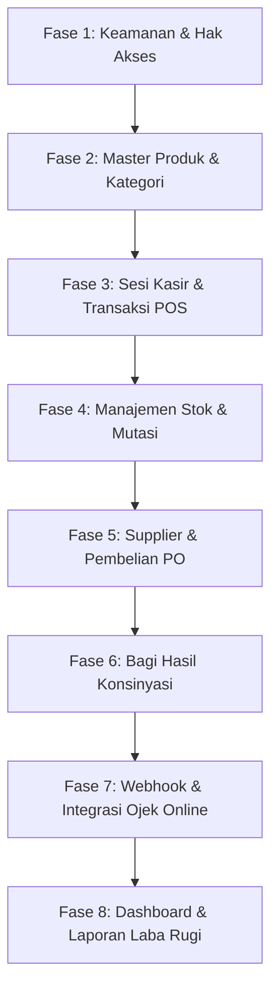
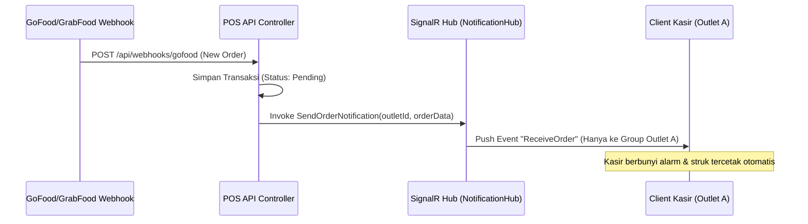

# Rencana Alur Pengerjaan (Development Roadmap) - MorrusPOS

Dokumen ini menjelaskan peta jalan (roadmap) langkah-demi-langkah pengerjaan proyek **MorrusPOS** secara menyeluruh berdasarkan 10 slide fitur utama yang Anda bagikan di awal, dilengkapi dengan contoh rancangan arsitektur khusus untuk penanganan **Real-Time (SignalR)**, **Offline Sync**, dan **Concurrency Control**.

---

## 🗺️ Gambaran Umum Fase Pengerjaan



---

## 🏗️ Arsitektur Teknis Khusus

Untuk memenuhi kebutuhan sistem POS modern, kita tidak bisa hanya menggunakan REST API biasa. Berikut adalah rancangan arsitektur teknis yang akan diimplementasikan dalam proyek ini:

### 1. Arsitektur Real-Time dengan ASP.NET Core SignalR

SignalR digunakan untuk melakukan *push notification* instan dari server ke kasir (misal jika ada pesanan GoFood/GrabFood masuk) atau menyinkronkan stok secara real-time antarkasir dalam satu cabang (outlet).

#### Alur Aliran Data (Data Flow):


#### Struktur Kode Backend (Contoh Hub):
```csharp
// Lokasi: src/MorrusPOS.Infrastructure/RealTime/NotificationHub.cs
using Microsoft.AspNetCore.SignalR;

namespace MorrusPOS.Infrastructure.RealTime;

public class NotificationHub : Hub
{
    // Mengelompokkan koneksi kasir berdasarkan OutletId agar notifikasi tidak nyasar ke cabang lain
    public async Task JoinOutletGroup(string outletId)
    {
        await Groups.AddToGroupAsync(Context.ConnectionId, $"Outlet_{outletId}");
    }

    public async Task LeaveOutletGroup(string outletId)
    {
        await Groups.RemoveFromGroupAsync(Context.ConnectionId, $"Outlet_{outletId}");
    }
}
```

#### Cara Backend Memicu Notifikasi dari Controller/Service:
```csharp
// Diinjeksikan lewat IHubContext<NotificationHub>
public class WebhookService 
{
    private readonly IHubContext<NotificationHub> _hubContext;

    public async Task ProcessGoFoodOrderAsync(OrderDto order)
    {
        // 1. Logika simpan DB...
        
        // 2. Broadcast ke semua kasir yang tergabung di group Outlet terkait
        await _hubContext.Clients.Group($"Outlet_{order.OutletId}")
            .SendAsync("ReceiveNewOrder", order);
    }
}
```

---

### 2. Arsitektur Sinkronisasi Offline (Offline-First)

Untuk mengantisipasi internet kasir yang sering mati-nyala di lapangan, aplikasi kasir (frontend/client) didesain menyimpan data secara lokal terlebih dahulu (SQLite/IndexedDB).

#### Mekanisme Sinkronisasi (Sync):
1. **Unduh Data Master (Pull)**: Saat pertama kali buka aplikasi (online), client mengunduh seluruh data produk, kategori, dan konfigurasi harga.
2. **Transaksi Mandiri (Offline)**: Kasir tetap bisa melakukan transaksi secara offline. Transaksi ini disimpan di database lokal client dan diberi tanda `is_synced = false`.
3. **Penyelarasan Data (Push / Sync)**: Begitu koneksi internet kembali normal, aplikasi client mengirimkan daftar transaksi offline tersebut ke endpoint `/api/sync/transactions`.
4. **Idempotency (Pencegahan Duplikasi)**: Setiap transaksi offline dibekali `ClientTransactionId` (UUID unik). Backend POS akan mengecek apakah ID tersebut sudah pernah di-sync sebelumnya atau belum guna menghindari pencatatan ganda.

---

### 3. Penanganan Concurrency (Mencegah Stok Minus/Bentrokan)

Saat ada flash sale atau toko sedang sangat ramai, beberapa kasir mungkin menjual produk terakhir di saat bersamaan. Kita mencegah "Over-selling" menggunakan **Optimistic Concurrency** bawaan EF Core.

#### Implementasi Backend:
Kita menambahkan kolom token pelacak versi di kelas `Product`:
```csharp
// Lokasi: src/MorrusPOS.Domain/Entities/Product.cs
public class Product : AuditableEntity
{
    // ... properti lainnya ...
    
    public uint Version { get; set; } // Token versi untuk melacak perubahan data stok/harga
}
```

Di dalam konfigurasi EF Core:
```csharp
// Lokasi: src/MorrusPOS.Infrastructure/Persistence/Configurations/CorePosConfigurations.cs
builder.Property(p => p.Version)
    .IsRowVersion(); // Menandai kolom ini sebagai pelacak konkurensi (Concurrency Token)
```

Saat kasir men-checkout barang, EF Core secara otomatis memverifikasi bahwa `Version` produk di database belum berubah semenjak kasir membaca data tersebut. Jika sudah diubah oleh kasir lain, transaksi kasir kedua akan menghasilkan `DbUpdateConcurrencyException` dan sistem akan memberi tahu kasir kedua secara anggun bahwa stok telah habis/berubah tanpa merusak konsistensi data database.

---

## 🛠️ Detail Fase Pengerjaan (Aplikasi, Logika, & API)

### Fase 1: Keamanan, Hak Akses & Profil Pengguna
Fokus pada pengamanan API dan pembagian wewenang untuk 6 Roles sesuai dengan slide keamanan.
* **Langkah Pengerjaan**:
  1. **Application Layer**: Buat handler pendaftaran user baru (registrasi) dan fitur ganti password.
  2. **Infrastructure Layer**: Buat Custom Authorization Middleware / Attribute untuk mengecek hak akses permission (misal: `[HasPermission("product.manage")]`).
  3. **Presentation Layer**: Buat endpoint `/api/users` (CRUD User) yang hanya bisa diakses oleh role `Owner` atau `Admin`.
* **Verifikasi**: Mencoba menembak API produk menggunakan token akun kasir (seharusnya ditolak `403 Forbidden`).

---

### Fase 2: Master Produk & Kategori (CRUD & Log Audit)
Mengelola database produk dan mencatat setiap perubahan harga atau status produk secara historis.
* **Langkah Pengerjaan**:
  1. **Application Layer**: Implementasikan logika CRUD Produk dan Kategori (menggunakan `FluentValidation` untuk mencegah SKU ganda).
  2. **Audit Trail**: Integrasikan dengan `AuditLogs`. Setiap terjadi perubahan harga jual (`BasePrice`) atau HPP (`CostPrice`), sistem harus menulis riwayat perubahan ke tabel `audit_logs` secara otomatis.
  3. **Presentation Layer**: Expose endpoint `/api/products` dan `/api/categories` dengan pengamanan token JWT.
* **Verifikasi**: Melakukan update harga produk di Swagger dan memastikan log audit mencatat data lama dan data baru secara detail.

---

### Fase 3: Sesi Kasir & Transaksi Penjualan POS (Real-Time)
Fokus pada alur kasir membuka shift, melakukan transaksi penjualan, cetak struk, dan menutup shift kasir.
* **Langkah Pengerjaan**:
  1. **Sesi Kasir**: Implementasikan `CashierSessionService` untuk membuka sesi (input modal awal), menghitung estimasi uang di laci kasir secara otomatis, dan menutup sesi (input uang fisik riil serta menghitung selisih/varian uang).
  2. **Transaksi POS**: Buat endpoint `/api/transactions/checkout`. Proses checkout harus:
     * Menyimpan data transaksi ke tabel `transactions` & `transaction_items`.
     * Mengurangi stok (`InventoryStock.QtyOnHand`) di outlet terkait secara otomatis.
     * Mencatat mutasi keluar pada buku besar stok (`StockLedger`).
  3. **SignalR Integration**: Pasang SignalR Hub. Setiap kali transaksi selesai, kirim notifikasi update stok ke seluruh layar kasir lain secara real-time.
* **Verifikasi**: Melakukan transaksi belanja kasir, memastikan stok langsung berkurang dan tercatat di StockLedger secara real-time.

---

### Fase 4: Manajemen Stok Opname & Transfer Cabang
Mengelola penyesuaian stok fisik dan pemindahan barang antarcabang untuk multi-outlet.
* **Langkah Pengerjaan**:
  1. **Stok Opname**: Logika penyesuaian stok. Jika jumlah fisik berbeda dengan sistem, hitung selisihnya, sesuaikan `QtyOnHand`, dan catat keterangannya ke `StockLedger` (tipe: `opname`).
  2. **Transfer Stok**: Alur pengiriman barang antarcabang:
     * Cabang A mengajukan transfer ke Cabang B (`status: pending`).
     * Kepala Cabang/Gudang menyetujui transfer (`status: approved`).
     * Sistem otomatis memotong stok Cabang A, menambah stok Cabang B, dan menulis log mutasi ke buku besar stok.
* **Verifikasi**: Menguji pengiriman 10 barang dari Outlet Utama ke Outlet Cabang dan memastikan kedua saldo stok ter-update dengan benar.

---

### Fase 5: Supplier, Pembelian (PO) & Utang Usaha
Fokus pada barang masuk dari supplier dan pencatatan utang tempo.
* **Langkah Pengerjaan**:
  1. **PO Penerimaan Barang**: Implementasikan pembuatan PO. Jika status PO diubah menjadi `Completed` (Barang Datang):
     * Sistem otomatis menambah stok (`InventoryStock.QtyOnHand`) di outlet penerima.
     * Mencatat harga beli terbaru ke `Product.CostPrice` (HPP ter-update).
  2. **Buku Utang**: Jika pembayaran bertipe `Tempo`, otomatis buat record di tabel `supplier_debts` beserta tanggal jatuh temponya.
  3. **Pembayaran Utang**: Logika pembayaran utang (`SupplierPayment`) yang mengurangi `RemainingAmount` pada buku utang terkait.
* **Verifikasi**: Menguji pemesanan barang via PO tempo, memastikan utang supplier bertambah, dan melakukan pembayaran utang.

---

### Fase 6: Barang Titipan / Konsinyasi (Bagi Hasil Otomatis)
Menangani barang titipan supplier dengan pemotongan bagi hasil otomatis saat barang laku di kasir.
* **Langkah Pengerjaan**:
  1. **Tanda Terima Konsinyasi**: Penerimaan barang konsinyasi beserta penetapan bagi hasil per item (`UnitCost`).
  2. **Hook Transaksi Penjualan**: Pada logika checkout transaksi POS (Fase 3), tambahkan pengecekan: jika item yang terjual adalah produk konsinyasi, secara otomatis buat baris di tabel `consignment_sales`.
  3. **Pelunasan Hak Supplier (Settlement)**: Fitur pelunasan pembayaran konsinyasi ke supplier untuk barang-barang titipan yang sudah laku terjual.
* **Verifikasi**: Menjual barang titipan di kasir POS $\rightarrow$ Memastikan hak bagi hasil supplier tercatat otomatis $\rightarrow$ Melakukan settlement pembayaran bagi hasil.

---

### Fase 7: Webhook & Integrasi Ojek Online (Grab/Go/ShopeeFood) & Webhook
Integrasi pesanan dari ojek online dan pencocokan uang masuk.
* **Langkah Pengerjaan**:
  1. **Webhook Receiver**: Endpoint API publik untuk menerima pesanan Grab/Go/Shopee secara real-time.
  2. **SignalR Push Notification**: Begitu pesanan online diterima backend, kirim push notification beserta suara alarm kasir ke cabang terkait.
  3. **Rekonsiliasi Keuangan (Settlement)**: Layanan untuk memproses data pencairan dana ojek online, menghitung potongan komisi aplikasi, dan mencatat dana bersih.
* **Verifikasi**: Simulasi kiriman pesanan dari GoFood webhook, memastikan alarm kasir berbunyi real-time.

---

### Fase 8: Dashboard Pemantauan & Laporan Keuangan (Laba Rugi)
Menampilkan visualisasi grafik tren penjualan dan laporan laba rugi.
* **Langkah Pengerjaan**:
  1. **Dashboard Query**: Agregasi data penjualan, metode pembayaran terpopuler, perbandingan omzet offline vs online, dan produk terlaris.
  2. **Laporan Laba Rugi**: Menghitung pendapatan kotor dikurangi HPP (diambil dari snapshot `UnitCost` pada penjualan item) untuk mendapatkan laba kotor real-time.
  3. **Ekspor Laporan**: Layanan ekspor laporan ke format Excel dan PDF.
* **Verifikasi**: Membuka dashboard dan memastikan grafik performa cabang tampil sesuai dengan data transaksi riil.
