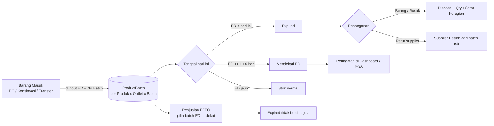

# Modul Kedaluwarsa (Expired) — Implementasi Plan

Dokumen ini adalah rencana implementasi **Modul Kedaluwarsa (Expired)** untuk MorrusPOS.
Modul ini menangani produk yang memiliki tanggal kedaluwarsa (ED = expired date): pelacakan batch,
deteksi otomatis stok kedaluwarsa & mendekati kedaluwarsa, pencegahan penjualan barang kadaluarsa (FEFO),
penanganan (buang / retur supplier) yang tercatat, hingga laporan kerugian.

---

## 1. Visi Modul



Tujuan bisnis:
1. Kasir tidak pernah menjual produk yang sudah kadaluarsa (blokir otomatis).
2. Stok yang mendekati ED terlihat lebih awal agar bisa didiskon/dikembalikan sebelum rugi.
3. Setiap barang yang dibuang/retur tercatat lengkap (siapa, kapan, berapa, kenapa) dan dihitung nilai kerugiannya (qty × HPP batch).
4. Laporan kerugian kedaluwarsa per outlet untuk evaluasi pembelian.

---

## 2. Keputusan Desain

| # | Keputusan | Rekomendasi | Alasan |
|---|-----------|-------------|--------|
| D1 | Granularitas pelacakan | **Batch-level** (`ProductBatch`), bukan kolom `ExpiryDate` di `Product` | Satu produk diisi stok berkali-kali dengan ED berbeda (mis. susu: batch Jan & batch Mar). Kolom tunggal di Product tidak akurat untuk perhitungan stok ED. |
| D2 | Cakupan produk | Hanya produk bertanda **`IsPerishable = true`** yang wajib batch | Tidak semua produk punya ED (elektronik, alat tulis). Menghindari beban input batch untuk semua produk & migrasi data lama. |
| D3 | Sumber batch | Semua alur **barang masuk** menjadi titik input batch: PO receive, penerimaan konsinyasi, transfer masuk | Agar qty batch selalu sinkron dengan stok global sejak awal. |
| D4 | Penjualan | **FEFO otomatis** (First Expired First Out) saat checkout + **blokir batch expired** | Kasir tidak perlu memilih batch manual; risiko jual barang basi hilang. Kasir tetap bisa melihat ED batch di layar POS. |
| D5 | Penanganan | Entitas `ExpiryDisposal` (buang / retur supplier / rusak) dengan **snapshot HPP batch** saat penerimaan | Snapshot di `ProductBatch.CostSnapshot` membuat kerugian akurat walau `Product.CostPrice` berubah setelahnya. |
| D6 | Ambang peringatan | `NearExpiryDays` di level **Business** (default 30 hari, bisa diubah) | Satu nilai global, tanpa per-produk (bisa fase lanjutan jika diperlukan). |
| D7 | Konsistensi stok | `StockLedger` ditambah kolom **nullable `BatchId`** + trigger DB kedua untuk update `product_batch.qty_on_hand` | Mengikuti pola trigger yang sudah ada (`fn_update_inventory_stock`) sehingga batch selalu konsisten dengan ledger. |
| D8 | Stok lama (legacy) | Stok tanpa batch diperlakukan sebagai **non-batch / non-expiring** | Tidak ada cara valid menentukan ED stok lama. Fitur opsional fase lanjutan: input manual batch untuk stok existing via UI. |
| D9 | Permission | Pakai **`stock.manage`** yang sudah ada (fase lanjutan: permission khusus `expiry.manage`) | Percepatan rilis; role Gudang/Admin/Owner sudah punya akses. |

---

## 3. Skema Data

### 3.1 Entitas baru: `ProductBatch`

```csharp
// MorrusPOS.Domain/Entities/ProductBatch.cs
public class ProductBatch : BaseEntity
{
    public Guid ProductId { get; set; }
    public Product Product { get; set; } = default!;

    public Guid OutletId { get; set; }
    public Outlet Outlet { get; set; } = default!;

    public string BatchNumber { get; set; } = default!;   // manual atau auto: "B-{ED}-{4 digit}"
    public DateTime ExpiryDate { get; set; }              // ED, wajib untuk produk perishable
    public decimal QtyOnHand { get; set; }                // di-update via TRIGGER DB (lihat 3.4)
    public decimal CostSnapshot { get; set; }             // HPP unit saat batch diterima (untuk hitung kerugian)

    public string SourceType { get; set; } = default!;    // "purchase_order" | "consignment" | "stock_transfer" | "manual"
    public Guid SourceId { get; set; }                    // polimorfik, tanpa FK

    public DateTime ReceivedAt { get; set; } = DateTime.UtcNow;
    public bool IsActive { get; set; } = true;            // soft-disable bila stok 0 & sudah lewat (arsip)
}
```

Unik: `(ProductId, OutletId, BatchNumber)`. Index: `(OutletId, ExpiryDate)` untuk query expired/near-expiry.

### 3.2 Perubahan `Product`

```csharp
public bool IsPerishable { get; set; } = false;  // produk wajib pakai batch + ED
```

### 3.3 Perubahan `StockLedger`

```csharp
public Guid? BatchId { get; set; }               // nullable: null = non-batch movement (behaviour lama tetap jalan)
public ProductBatch? Batch { get; set; }
```

Ditambah konstanta movement type baru di `StockMovementType`:

```csharp
public const string ExpiredDisposal = "expired_disposal";  // pengurangan stok saat buang/rusak
```

### 3.4 Entitas baru: `ExpiryDisposal`

```csharp
// MorrusPOS.Domain/Entities/ExpiryDisposal.cs
public class ExpiryDisposal : BaseEntity
{
    public string DisposalNumber { get; set; } = default!;  // "DSP-{yyyyMMddHHmmss}-{rand}"
    public Guid OutletId { get; set; }
    public Outlet Outlet { get; set; } = default!;

    public string Reason { get; set; } = default!; // "expired" | "optimal_ed" (buang dini) | "damaged" | "other"
    public string? Note { get; set; }

    public Guid DisposedBy { get; set; }
    public User DisposedByUser { get; set; } = default!;

    public DateTime CreatedAt { get; set; } = DateTime.UtcNow;

    public ICollection<ExpiryDisposalItem> Items { get; set; } = new List<ExpiryDisposalItem>();
}

public class ExpiryDisposalItem : BaseEntity
{
    public Guid ExpiryDisposalId { get; set; }
    public ExpiryDisposal ExpiryDisposal { get; set; } = default!;

    public Guid BatchId { get; set; }
    public ProductBatch Batch { get; set; } = default!;

    public decimal Qty { get; set; }                       // qty dibuang dari batch tsb
    public decimal UnitCost { get; set; }                  // snapshot dari batch.CostSnapshot
    public decimal TotalLoss { get; set; }                 // Qty × UnitCost
}
```

### 3.5 Konfigurasi EF Core

File baru `backend/src/MorrusPOS.Infrastructure/Persistence/Configurations/ExpiryConfigurations.cs`:

- `ProductBatchConfiguration`: table `product_batch`; unik `(ProductId, OutletId, BatchNumber)`; `QtyOnHand`/`CostSnapshot` decimal(12,2); FK Product & Outlet `Restrict`; index `(OutletId, ExpiryDate)`.
- `ExpiryDisposalConfiguration`: table `expiry_disposals`; `DisposalNumber` max 30 unik; FK Outlet & DisposedByUser `Restrict`.
- `ExpiryDisposalItemConfiguration`: table `expiry_disposal_items`; FK `ExpiryDisposal` cascade; FK Batch `Restrict`.
- `StockLedgerConfiguration`: tambah kolom `BatchId` nullable + FK opsional `Restrict` ke `product_batch`.
- `FoundationConfigurations.cs`: tambah permission seed `expiry.manage` (opsional, lihat D9).
- `AppDbContext`: tambah 3 `DbSet` baru.

### 3.6 Migration & Trigger DB (pola sama seperti StockLedgerTrigger.sql)

Migration baru: `AddExpiredModule` (`dotnet ef migrations add AddExpiredModule`). Isi `Up()`:

```sql
-- 1. Kolom ProductBatch & trigger sinkronisasi: update product_batch.qty_on_hand
--    setiap ada stock_ledger insert dengan BatchId NOT NULL
CREATE OR REPLACE FUNCTION fn_update_product_batch()
RETURNS TRIGGER AS $$
BEGIN
    IF NEW."BatchId" IS NOT NULL THEN
        UPDATE "product_batch"
        SET "QtyOnHand" = "QtyOnHand" + NEW."QtyChange",
            "UpdatedAt" = now()
        WHERE "Id" = NEW."BatchId";
    END IF;
    RETURN NEW;
END;
$$ LANGUAGE plpgsql;

CREATE TRIGGER trg_stock_ledger_batch_insert
AFTER INSERT ON "stock_ledger"
FOR EACH ROW
EXECUTE FUNCTION fn_update_product_batch();
```

> Catatan: trigger batch hanya UPDATE (tidak INSERT/created) — batch dibuat eksplisit di service layer
> (karena butuh `ExpiryDate`, `BatchNumber`, `CostSnapshot`, `SourceType`). Ini beda dengan `inventory_stock`
> yang auto-insert karena unik (product,outlet).

---

## 4. Perubahan Backend (per file)

### 4.1 `IStockService` / `StockService` (Application + Infrastructure)

Perluas `AddMovementAsync` dengan overload batch-aware agar semua caller tidak wajib diubah:

```csharp
Task AddMovementAsync(
    Guid productId, Guid outletId, decimal qtyChange, string movementType,
    string referenceType, Guid referenceId, string? note = null,
    Guid? batchId = null,                                    // BARU
    CancellationToken ct = default);
```

Validasi di `StockService` saat `batchId != null`:
- Batch harus milik `ProductId` + `OutletId` yang sama.
- Qty batch TIDAK boleh negatif setelah perubahan (guard di service + trigger CHECK constraint `qty_on_hand >= 0`).
- `movementType` yang diizinkan memakai batch: `sale`, `return`, `transfer_out`, `transfer_in`, `opname_adjustment`, `supplier_return_out`, `expired_disposal`, `consignment_return`.

### 4.2 `PurchaseOrderService` — input batch saat penerimaan barang

- `CreatePurchaseOrderRequest.Items` ditambah `ExpiryDate?` + `BatchNumber?` (opsional untuk non-perishable, **wajib** jika produk `IsPerishable`).
- Saat PO di-`Completed` (Receive Goods):
  1. Sebelum `AddMovementAsync(purchase_in)` → buat/ambar `ProductBatch` (qty = `item.Qty`, `CostSnapshot = item.UnitCost`, `SourceType = "purchase_order"`, `SourceId = po.Id`).
  2. `batchId` baru ini diteruskan ke `AddMovementAsync(..., batchId: newBatch.Id)`.
- Validator baru: `CreatePurchaseOrderRequestValidator` disesuaikan — jika produk perishable maka `ExpiryDate` wajib & harus `> DateTime.UtcNow.Date`.
- Konsinyasi (payment type consignment): sama, `SourceType = "consignment"`, movement `consignment_in` memakai batch.

### 4.3 `ConsignmentService` — penerimaan barang titipan

- `ConsignmentItem` ditambah `ExpiryDate?` + `BatchNumber?` (wajib bila produk perishable).
- Penerimaan konsinyasi membuat `ProductBatch` (`SourceType = "consignment"`).
- **`ConsignmentReturnService`**: saat retur barang titipan, batch dipilih FEFO (atau pilihan manual di UI), movement `consignment_return` + `batchId`.

### 4.4 `StockTransferService` — transfer batch antar outlet

- `StockTransferItemRequest` ditambah `BatchId?` + `Qty` per batch (UI pakai FEFO picker).
- Validation: qty batch cukup di outlet asal; batch tidak expired.
- Saat approve:
  - `transfer_out` dari batch asal (dengan `BatchId`).
  - `transfer_in` masuk sebagai **batch baru** di outlet tujuan dengan `ExpiryDate`, `BatchNumber`, dan `CostSnapshot` yang sama (komposisi identik).
- Jika barang non-perishable → perilaku lama (tanpa batch).

### 4.5 `StockOpnameService` — opname batch-aware

- `CreateStockOpnameRequest.Items` untuk produk perishable menuntut **pengisian per batch**: `(BatchId, PhysicalQty)` plus varian "batch baru ditemukan di fisik" (buat batch manual dengan ED diisi kasir) dan "batch hilang dari sistem" (adjustment −qty).
- Variance per batch memakai `AddMovementAsync(opname_adjustment, batchId)`.
- **UI hal ini penting**: alur opname dimodifikasi agar setiap produk perishable menampilkan daftar batch + stok per batch (bukan satu angka).

### 4.6 `SupplierReturnService` — retur ke supplier dari batch spesifik

- `SupplierReturnItemRequest` ditambah `BatchId?`.
- Retur barang rusak/ED → pilih batch (FEFO default), movement `supplier_return_out` + `batchId`.
- UI menampilkan daftar batch + ED agar kasir/gudang bisa memilih batch yang tepat untuk dikembalikan ke supplier.

### 4.7 `TransactionService` — FEFO + blokir expired (kunci modul)

Saat checkout, untuk setiap item produk perishable:
1. Ambil batch aktif outlet tsb: `QtyOnHand > 0`, urut **`ExpiryDate ASC`** (FEFO).
2. **Blokir**: batch dengan `ExpiryDate < today` → SKIP (tidak diikutkan penjualan).
3. Alokasikan qty secara berurutan antar batch (loop) sampai qty terpenuhi:
   - batch A sisa 2, butuh 5 → `2` ke batch A, `3` ke batch B.
4. Setiap alokasi = satu `StockLedger` row (`movementType = "sale"`, `batchId`).
5. Bila total batch valid < qty minta → `InvalidOperationException: "Stok valid (belum kadaluarsa) tidak mencukupi"` (kasir melihat pesan jelas, bukan stok habis saja).
6. `TransactionItem` ditambah kolom nullable `BatchId` untuk jejak audit penjualan per batch.

Tambahan response DTO: `TransactionItemDto` berisi `ExpiryDate` batch yang terjual (untuk struk & laporan).

> Catatan Penting: proses ini harus tetap dalam satu `dbTx` + `SaveChangesAsync` — trigger DB menjumlahkan per row
> sehingga `inventory_stock` otomatis benar.

### 4.8 Service baru: `IExpiryService` / `ExpiryService`

```csharp
// MorrusPOS.Application/Features/Expiry/ExpiryContracts.cs
public record ProductBatchDto(Guid BatchId, Guid ProductId, string Sku, string ProductName,
    string CategoryName, string? Barcode, string Unit, string BatchNumber, DateTime ExpiryDate,
    decimal QtyOnHand, decimal CostSnapshot, int DaysToExpiry, bool IsExpired, bool IsNearExpiry,
    DateTime ReceivedAt);

public record ExpirySummaryDto(int ExpiredCount, decimal ExpiredQty, decimal ExpiredLoss,
    int NearExpiryCount, decimal NearExpiryQty, decimal TotalQtyOnHand);

public record DisposalItemDto(Guid BatchId, string ProductName, string Sku, string BatchNumber,
    DateTime ExpiryDate, decimal Qty, decimal UnitCost, decimal TotalLoss);

public record ExpiryDisposalDto(Guid Id, string DisposalNumber, Guid OutletId, string OutletName,
    string Reason, string? Note, Guid DisposedBy, string DisposedByName, DateTime CreatedAt,
    decimal TotalLoss, IReadOnlyList<DisposalItemDto> Items);

public record DisposeExpiredRequest(Guid OutletId, string Reason, string? Note,
    IReadOnlyList<DisposeExpiredItemRequest> Items);
public record DisposeExpiredItemRequest(Guid BatchId, decimal Qty);

public interface IExpiryService
{
    Task<ExpirySummaryDto> GetSummaryByOutletAsync(Guid outletId, CancellationToken ct = default);
    Task<IReadOnlyList<ProductBatchDto>> GetExpiredByOutletAsync(Guid outletId, string? search = null, CancellationToken ct = default);
    Task<IReadOnlyList<ProductBatchDto>> GetNearExpiryByOutletAsync(Guid outletId, string? search = null, int? days = null, CancellationToken ct = default);
    Task<IReadOnlyList<ProductBatchDto>> GetBatchesByOutletAsync(Guid outletId, string? search = null, bool includeCompleted = false, CancellationToken ct = default);
    Task<ExpiryDisposalDto> DisposeAsync(Guid userId, DisposeExpiredRequest request, CancellationToken ct = default);
    Task<IReadOnlyList<ExpiryDisposalDto>> GetDisposalsByOutletAsync(Guid outletId, CancellationToken ct = default);
}
```

Logika `DisposeAsync`:
1. Per item: ambil batch, validasi qty ≤ `QtyOnHand`, ED sudah lewat (kecuali reason `"optimal_ed"`=buang dini boleh).
2. Buat `ExpiryDisposal` + `ExpiryDisposalItem` (snapshot `UnitCost = batch.CostSnapshot`).
3. `AddMovementAsync(expired_disposal, −qty, batchId)` per item — sekali lagi trigger batch meng-update `product_batch.qty_on_hand`.
4. Simpan, broadcast `SendStockUpdateAsync` (stok berubah di outlet tsb).
5. `TotalLoss` dihitung dari item, direturn ke UI.

### 4.9 Setting near-expiry window

- Kolom `NearExpiryDays` (int, default 30) di entitas `Business` (atau tabel `BusinessSettings`.
- `ExpiryService` membaca dari `Business` yang terhubung ke outlet; fallback 30.

### 4.10 Validator baru

- `DisposeExpiredRequestValidator`: outlet valid, minimal 1 item, qty > 0, reason ∈ {expired, optimal_ed, damaged, other}.
- Update `CreatePurchaseOrderRequestValidator`, `CreateStockTransferRequestValidator`, `CreateStockOpnameRequestValidator` (aturan batch wajib untuk produk perishable).

---

## 5. API Endpoints

Controller baru: `backend/src/MorrusPOS.Api/Controllers/ExpiriesController.cs` (`[HasPermission("stock.manage")]`, pola `ResolveTargetOutletId` sama seperti `InventoryController`):

| Method | Route | Fungsi |
|--------|-------|--------|
| GET | `/api/expiries/summary?outletId=` | Kartu ringkasan: jumlah & nilai kerugian expired, jumlah near-expiry |
| GET | `/api/expiries/expired?outletId=&search=` | Daftar batch yang sudah kadaluarsa (qty > 0) |
| GET | `/api/expiries/near-expiry?outletId=&search=&days=` | Daftar batch mendekati ED (default 30 hari) |
| GET | `/api/expiries/batches?outletId=&search=&includeCompleted=` | Semua batch aktif per outlet |
| POST | `/api/expiries/dispose` | Jalankan penanganan buang/rusak (multi-item) |
| GET | `/api/expiries/disposals?outletId=` | Riwayat penanganan (buang/rusak) + total kerugian |

Permintaan data untuk POS tetap lewat endpoint yang ada (`GET /api/inventory`), namun response
`InventoryListItemDto` ditambah 2 field: `IsExpired` dan `DaysToExpiry` (null bila non-batch) agar
layar kasir bisa menandai tanpa request tambahan.

---

## 6. Frontend (React)

### 6.1 Folder feature baru: `frontend/src/features/expired/`

```text
expired/
├── api/expiryApi.ts          # getExpirySummary, getExpired, getNearExpiry, getBatches, disposeExpired, getDisposals
├── components/
│   ├── ExpirySummaryCards.tsx      # kartu: Total Batch, Expired (qty+nilai), Mendekati ED (qty+nilai)
│   ├── BatchTable.tsx              # tabel batch: produk, no batch, ED, sisa qty, D+ hari, badge status
│   ├── ExpiryStatusBadge.tsx       # badge "Expired" (merah) / "D+N hari" (kuning) / "Aman" (hijau)
│   ├── DisposeModal.tsx            # modal pilih batch + qty + reason + catatan
│   └── DisposalHistoryTable.tsx    # riwayat penanganan + kolom total kerugian
├── hooks/useExpiryData.ts
├── pages/ExpiredPage.tsx      # tab: Kedaluwarsa | Mendekati ED | Semua Batch | Riwayat Penanganan
├── types/expiry.ts
└── index.ts
```

### 6.2 Halaman `ExpiredPage`

- Header: `title="Kedaluwarsa"`, description natural (bukan catatan fase) — misal
  *"Pantau stok kadaluarsa dan mendekati kedaluwarsa per outlet, serta kelola penanganan barang buang atau rusak."*
- Tab "Kedaluwarsa": tabel batch `ExpiryDate < today` + tombol **"Buang / Rusak"** → `DisposeModal`.
- Tab "Mendekati ED": sama dengan filter `days` (default 30, bisa diubah inline).
- Tab "Semua Batch": daftar lengkap + filter search, opsional `includeCompleted`.
- Tab "Riwayat Penanganan": `ExpiryDisposalDto` + nilai kerugian total.
- Pakai `useStockOutletScope` (sama seperti InventoryPage) untuk outlet selector Owner vs non-Owner.

### 6.3 Integrasi lain

- **`ProductsPage` + `ProductForm`**: tambah field toggle **"Produk mudah kedaluwarsa (perishable)"** → `IsPerishable`.
  Saat diaktifkan, tampil hint bahwa ED/No batch wajib diisi di alur penerimaan barang.
- **`InventoryPage`**: kolom/badge baru — `ExpiryStatusBadge` (Expired / D+N / —), dan filter "Tampilkan hanya expired".
- **`PosPage`**: saat produk perishable dipilih, tampilkan daftar batch (ED, sisa qty, D+N). Produk expired:
  - ditandai abu-abu + label "Kadaluarsa",
  - **tidak bisa ditambahkan ke keranjang** (disabled).
  - Saat checkout, backend tetap menolak (double safety).
- **`PurchaseOrderCreatePage`**: per item, jika produk perishable tampil field `ExpiryDate` (date input) + `BatchNumber` (opsional, default auto). Warning: "ED wajib untuk produk ini".
- **`StockTransferCreateModal`**: picker batch FEFO per item.
- **`StockOpnameCreatePage`**: editor per batch untuk produk perishable.
- **`SupplierReturnFormPage`**: picker batch saat retur.
- **`DashboardPage`**: kartu "Peringatan Kedaluwarsa" — jumlah produk expired + near-expiry (data dari `/api/expiries/summary`), klik → `/expired`.
- **`ReportsPage`** (opsional): laporan "Rekap Kerugian Kedaluwarsa" (qty × CostSnapshot per bulan, per outlet).

### 6.4 Routing & Navigasi

- `navigation.tsx`: tambah sub-item di grup **"Produk & Stok"**:
  `{ label: "Kedaluwarsa", path: "/expired", requiredPermissions: ["stock.manage"], fallbackRoles: stockRoles }`.
- `AppRouter.tsx`: route `path="expired"` dengan `PermissionGuard` memakai `expiredPolicy = getNavigationItem("/expired")`.

---

## 7. Real-time (SignalR)

- Tidak ada event baru wajib; `SendStockUpdateAsync` sudah dipicu dari disposal & sale.
- Pilihan fase lanjutan: event `ExpiryUpdate` per outlet untuk refresh kartu dashboard tanpa manual reload.
- `useRealtime` di frontend sudah tersedia → setelah disposal, panggil `loadExpiryData()`.

---

## 8. Mobile (Flutter) — Fase Lanjutan

- `mobile/lib/features/products`: tampilkan `ExpiryStatusBadge` + kolom ED di daftar produk.
- POS mobile (checkout): FEFO otomatis + block expired sudah ditangani backend; tambahan UI warning.
- Tidak menghalangi rilis web; backend contract sudah stabil.

---

## 9. Aturan Bisnis & Edge Cases

1. **ED sudah lewat** → batch dianggap expired; tidak ikut penjualan; harus di-dispose/di-return agar qty-nya keluar dari sistem.
2. **Qty batch tidak boleh negatif** → check di service + `CHECK (qty_on_hand >= 0)` di migration.
3. **Alokasi FEFO partial** → alokasi berhenti di batch pertama yang masih valid jika qty cukup; kalau tidak, lanjut batch berikutnya; kalau total kurang → tolak transaksi dengan pesan jelas.
4. **Produk diubah dari non-perishable → perishable**: stok legacy (tanpa batch) tetap bisa dijual (dianggap batch-"legacy" tanpa ED). Opsi fase lanjutan: *manual batch entry* untuk stok lama.
5. **Transfer batch**: tidak bisa transfer batch expired (diblokir di validation). Batch tujuan meneruskan `ExpiryDate` & `BatchNumber` agar pelacakan tetap utuh.
6. **Konsinyasi**: barang titipan yang expired → prefer retur ke supplier (alur `consignment_return`) supaya tidak jadi beban toko; kalau terlanjur rusak → disposal dengan reason `damaged`.
7. **Opname menemukan batch baru/dobel** → kasir boleh membuat batch manual (ED wajib) dan selisih dicatat sebagai `opname_adjustment` dengan batchId.
8. **Disposal bulk satu batch>1 row?** Tidak: 1 item disposal = 1 batch (qty boleh parsial).
9. **Snapshot HPP**: kerugian kalkulasi memakai `CostSnapshot` batch, bukan `Product.CostPrice` saat ini.
10. **Time zone**: semua perbandingan ED memakai tanggal lokal outlet (`DateOnly`); simpan `ExpiryDate` sebagai `date` (bukan timestamp) untuk hindari offset.

---

## 10. Rencana Pengujian

### Unit Tests (`backend/tests/MorrusPOS.UnitTests/`)

| File baru | Kasus |
|-----------|-------|
| `ExpiryServiceTests.cs` | summary menghitung expired/near-expiry benar; disposal mengurangi batch & ledger; totalLoss = qty×CostSnapshot; validasi qty > on-hand ditolak; reason invalid ditolak |
| `FefoAllocationTests.cs` | alokasi 1 batch; cross-batch; expired batch dilewati; stok valid kurang → tolak |
| `PurchaseOrderValidatorExpiryTests.cs` | produk perishable tanpa ED ditolak; ED di masa lalu ditolak |
| Update `TransactionServiceTests.cs` | transaksi produk perishable menghasilkan multi-ledger per batch; struk membawa batch info |
| Update `StockTransferServiceTests.cs` | transfer per batch; batch expired tidak bisa ditransfer |
| Update `StockOpnameServiceTests.cs` | opname per batch |

### Integration Tests (`backend/tests/MorrusPOS.IntegrationTests/`)

- `ExpiriesControllerTests.cs`: auth outlet scope (Owner vs Kasir); endpoint summary/expired/near-expiry/dispose.
- Flow end-to-end: buat PO (ED input) → complete → cek batch muncul → checkout FEFO → cek batch terpotong → dispose sisa → cek kerugian & `InventoryStock.QtyOnHand` sinkron (trigger).

### Manual Testing Checklist (contoh skenario)

1. Produk perishable baru → buat PO dengan ED 10 hari → lengkapi → cek di tab "Mendekati ED".
2. PO produk perishable tanpa ED → harus ditolak validator.
3. Buat PO ED sudah lewat → penjualan produk tsb harus **ditolak** karena expired.
4. Stok batch 2 ED berbeda → jual qty besar → cek ledger: batch ED dekat terpotong dulu (FEFO).
5. Dispose batch expired → cek qty batch 0, `inventory_stock` berkurang, riwayat + total loss muncul.
6. Transfer batch antar outlet → ED & nomor batch terbawa.
7. Opname batch-aware.
8. Dashboard widget muncul; role Kasir tidak melihat menu Kedaluwarsa (tanpa `stock.manage`).

---

## 11. Fase Implementasi & Estimasi

| Fase | Lingkup | File utama | Estimasi |
|------|---------|-----------|----------|
| 1. Data layer | Entitas + konfigurasi + migration + trigger + permission seed | ProductBatch.cs, ExpiryDisposal.cs, ExpiryConfigurations.cs, AddExpiredModule migration, StockLedger.cs, Product.cs | 0.5–1 hari |
| 2. Core stok | `StockService` overload batchId + validasi; blok FEFO di `TransactionService` | StockService.cs, TransactionService.cs, StockContracts | 1–1.5 hari |
| 3. Alur masuk/keluar stok | PO receive, konsinyasi, transfer, opname, supplier return — batch-aware | PurchaseOrderService.cs, ConsignmentService.cs, StockTransferService.cs, StockOpnameService.cs, SupplierReturnService.cs + validator | 2 hari |
| 4. Expiry service + API | `IExpiryService`, controller, DTO, validators | ExpiryService.cs, ExpiryContracts.cs, ExpiriesController.cs | 1 hari |
| 5. Frontend module | folder `features/expired` + routing + navigasi | ExpiredPage.tsx, api/components/hooks, navigation.tsx, AppRouter.tsx | 1.5–2 hari |
| 6. Integrasi UI lain | ProductForm, InventoryPage, PurchaseOrderCreatePage, StockTransferCreateModal, OpnameCreate, SupplierReturn, PosPage | frontend/src/features/... | 2–3 hari |
| 7. Dashboard + laporan | widget summary + report kerugian | DashboardPage.tsx, ReportsPage.tsx, DashboardService.cs, ReportService.cs | 1 hari |
| 8. Tests | unit + integration + checklist manual | tests/... | 1–1.5 hari |
| 9. Mobile (opsional) | badge & warning di aplikasi Flutter | mobile/lib/features/... | 1–2 hari |

**Total: ± 10–13 hari kerja** (tanpa mobile: ± 9–11 hari).

---

## 12. Risiko & Mitigasi

| Risiko | Mitigasi |
|--------|----------|
| Trigger batch vs service double-update | Trigger hanya dipasang pada `stock_ledger` INSERT; service TIDAK menulis `product_batch.qty_on_hand` langsung → satu sumber update saja. |
| Performa alokasi FEFO saat transaksi ramai | Query batch index `(OutletId, ExpiryDate)`; alokasi per produk = 1 query awal + update batch sesudahnya; multi-kasir dilindungi transaksi DB + row lock (`SELECT ... FOR UPDATE` pada row batch). |
| Kesalahan input ED saat penerimaan barang | Validator buyer-side + konfirmasi popup saat ED < hari ini saat input. |
| Produk legacy tanpa batch | Skenario "non-batch" tetap berfungsi penuh (semua path lama). Tidak ada migrasi paksa. |
| Scope modul terlalu besar untuk rilis awal | Rilis bertahap: (1) batch + FEFO + disposal, (2) transfer/opname batch-aware, (3) report & mobile. |